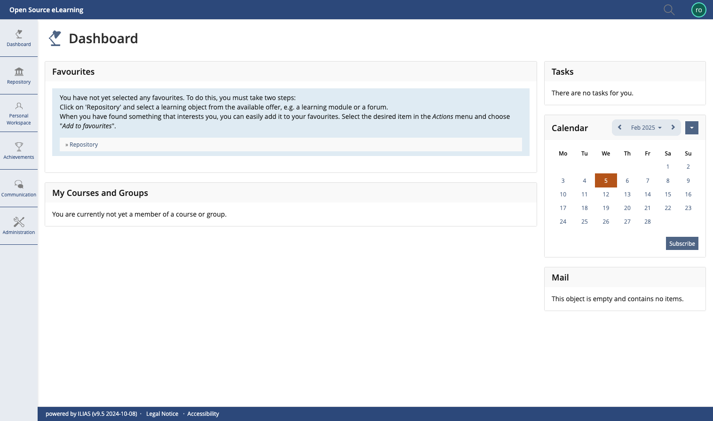

# StudIP-ILIAS Skin
Dieser Skin wurde an das [StudIP](https://www.studip.de/) Style angepasst.

## Version
v1.2.0

- [CHANGELOG](CHANGELOG.md)

## Screenshot


## Installation

Um das Skin zu installieren, man geht zur {ILIAS Root} installation, z.B.
`/srv/ilias-studip/ILIAS`

```
cd /srv/ilias-studip/ILIAS/
cd Customizing/global/
```


Falls das Ordner "skin" nicht vorhanden, dann anlegen:

```
mkdir skin
cd skin
```

Nun innerhalb der Skin Ordner werden wir den LUH-Skin installieren, dazu einfach einen git clone ausführen:

`git clone https://github.com/iFadi/StudIP-ILIAS-Skin.git`

Dann den entsprechenden Branch bzw. Tag auschecken z.B.:

`git checkout tags/v1.2.0`

Das war es.

## Für die Implementierung

Die Struktur der Skin Version für ILIAS 9 folgt diesem Tutorial: https://www.youtube.com/watch?v=vM7Il5GDHYk

Im Ordner StudIP-ILIAS-Style befindet sich das delos Git Repo, das alle benötigten Dateien zur Änderung des Skins beinhaltet:
https://github.com/ILIAS-eLearning/delos/tree/release_9

Das Repo wird automatisch aus dem ILIAS Main Repo aktualisiert, somit können Kernänderungen schnell eingebunden werden. Alle Änderungen des Original Skins für diesen StudIP-ILIAS Skin sind im Code markiert und dokumentiert, siehe ```StudIP-ILIAS-Style/README.md```.

Sass-Dateien anpassen. Danach den Skript `update-skin.sh` als root ausführen, um die Sass-Dateien zu kompilieren.

```sudo ./update-skin.sh```

Dieser Skript benutzt die Systemzeit, um die CSS-Dateien mit eine eindeutige ID zu versehen.
Dieser ID wird an der Hauptdateiname des Skins `studip-ilias-style.css` angehängt, um das Neuladen der Skin Änderungen vom Browser zu erzwingen.

Falls in das Produktive-System kein lessc installiert ist, kann der oben genannte Script nicht ausgeführt werden.
Daher ist es vorteilhaft, die kompilierte `studip-ilias-style.css` z.B. auf einem Test System, in einem Tag/Skin-Version hinzuzufügen.


## Dieser release wurde auf folgende ILIAS Versionen getestet:
* v9.15

<strong>WICHTIG: Der Skin sollte für jede ILIAS Minor/Major Release auf funktionalität getestet werden.</strong>
